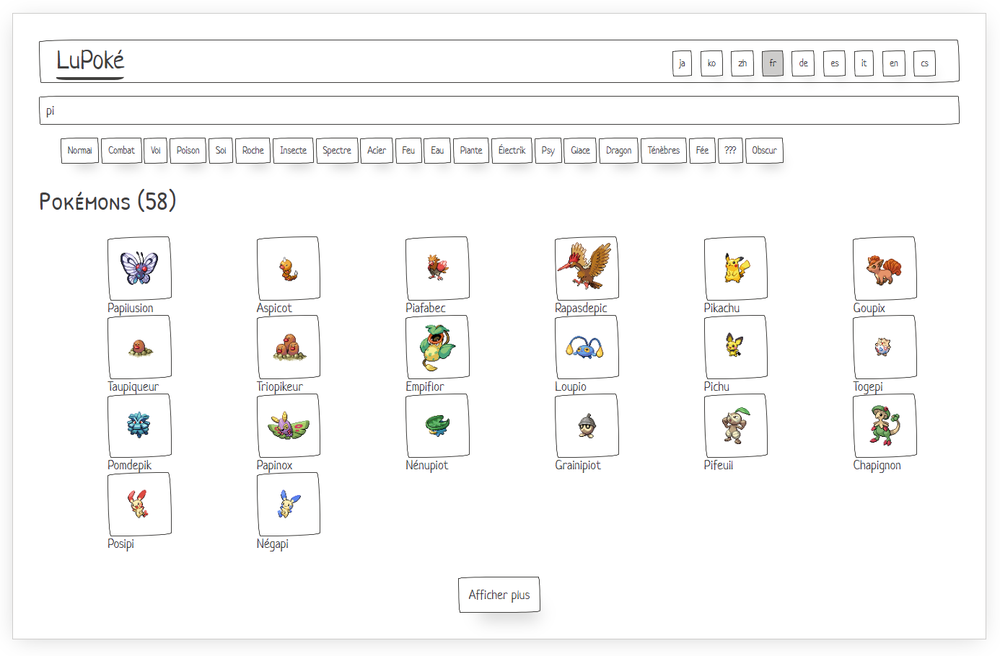

# Poke App

This project is a sandbox and can be used as a basis for workshops or training sessions, such as RxJS or ComponentStore.

This playground gives you a simple page with some available APIs. Models and http services are ready, all business logic can be implemented!



## Install

> npm ci

## Start

> npm start

## Server

A mocked backend is automatically started when running `npm start`. It offers some API:

### Languages

`GET /api/languages` returns a list of supported languages.

Example:

```json
["ja","ko","zh","fr","de","es","it","en","cs"]
```

### PokemonTypes

`GET /api/types` return a list of `PokemonType`.

Example:

```json
[
    {
        "id": "1",
        "name": "Normal"
    },
    {
        "id": "2",
        "name": "Fighting"
    },
    {
        "id": "3",
        "name": "Flying"
    }
]
```

It support querying with a `lang` to translates entities:

```json
// GET /api/types?lang=fr

[
  {
    "id": "1",
    "name": "Normal"
  },
  {
    "id": "2",
    "name": "Combat"
  },
  {
    "id": "3",
    "name": "Vol"
  }
]
```

### Pokemons

`GET /api/pokemons` return a `PokemonCollection`.

Example:

```json
{
  "count": 1017,
  "items": [
    {
      "id": "1",
      "name": "Bulbasaur",
      "description": "Seed Pokémon",
      "image": "https://raw.githubusercontent.com/PokeAPI/sprites/master/sprites/pokemon/1.png"
    },
    {
      "id": "2",
      "name": "Ivysaur",
      "description": "Seed Pokémon",
      "image": "https://raw.githubusercontent.com/PokeAPI/sprites/master/sprites/pokemon/2.png"
    },
    {
      "id": "3",
      "name": "Venusaur",
      "description": "Seed Pokémon",
      "image": "https://raw.githubusercontent.com/PokeAPI/sprites/master/sprites/pokemon/3.png"
    }
  ]
}
```

It support querying with:

* `lang` to translates entities
* `typeId` to return only Pokemons of provided type
* `search` to return only Pokemons with matching name
* `limit` to return only `<limit>` results (default to 20 items)
* `page` to return the `n`th page (starting from 1)

```json
// GET /api/pokemons?lang=fr&typeId=10&page=2&search=s&limit=3


{
  "count": 19,
  "items": [
    {
      "id": "156",
      "name": "Feurisson",
      "description": "Pokémon Volcan",
      "image": "https://raw.githubusercontent.com/PokeAPI/sprites/master/sprites/pokemon/156.png"
    },
    {
      "id": "157",
      "name": "Typhlosion",
      "description": "Pokémon Volcan",
      "image": "https://raw.githubusercontent.com/PokeAPI/sprites/master/sprites/pokemon/157.png"
    },
    {
      "id": "228",
      "name": "Malosse",
      "description": "Pokémon Sombre",
      "image": "https://raw.githubusercontent.com/PokeAPI/sprites/master/sprites/pokemon/228.png"
    }
  ]
}
```
